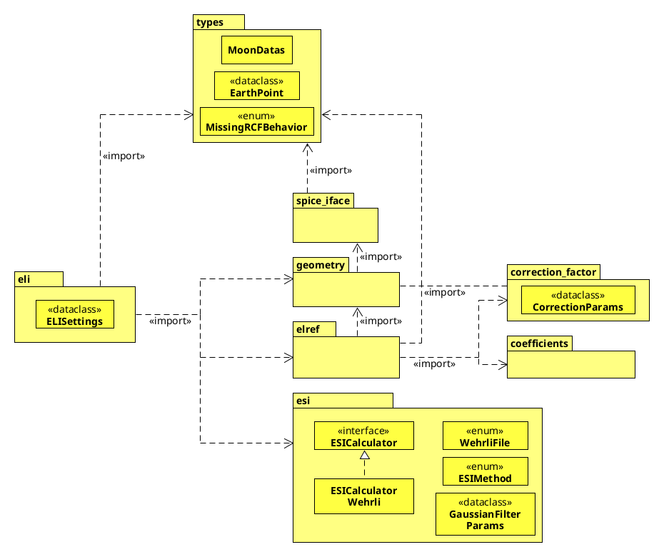

# Rimopy


Rimopy is a package consisting of an implementation of the ROLO model, following RIMO's
implementation, made in python.

The ROLO model comes from the RObotic Lunar Observatory, Kieffer and Stone, 2005.

The RIMO implementation is from multiple papers:
- Barreto et al., 2019: Evaluation of night-time aerosols measurements and lunar irradiance
models in the frame of the first multi-instrument nocturnal intercomparison campaign.
- Roman et al., 2020: Correction of a lunar-irradiance model for aerosol optical depth
retrieval and comparison with a star photometer.

## Requirements

- numpy >= 1.22.0
- scipy >= 1.7.3
- spiceypy >= 4.0.3

## Installation

At the moment it is only available at the test.pypi repository.

```sh
pip install -i https://test.pypi.org/simple/ rimopy-javgat==0.0.15
```

### Kernels

In order to use the package, a directory with all the kernels must be downloaded.

That directory must contain the same elements as **/tests/kernels**, and the execution must
be allowed to read and write from that directory.

## Structure

The package is divided in multiple modules, each dealing with different calculations and
functionalities:

- eli: Main module, which calculates the Extraterrestrial Lunar Irradiance for a given data.
- esi: Calculates the Extraterrestrial Solar Irradiance using data from Wehrli 1985. This data is modified
beforehand with **/utils/wehrli_gauss**
- coefficients: Contains the coefficient data from the ROLO model.
- correction_factor: Calculates the correction factor as stated in RIMO papers.
- spice_iface: Encapsulates the access to functionalities from SPICE Toolbox.
- MoonData: Contains MoonData class, which represents some of the needed data
for the calculation of extraterrestrial lunar irradiance.



## Build

```sh
python3 -m build
```

## Testing

### Testing setup

A virtual environment should be created inside the 'tests' directory.

```sh
python3 -m venv .venv
source .venv/bin/activate
```

The packages mentioned in [Requirements](#requirements) should be installed,
and finally the latest build should be installed.

```sh
pip install ../dist/rimopy_javgat-<latest_version>-py3-none-any.whl
```

### Executing the tests

At the moment only one test file exists, test_eli.py, but that will be different in the future.